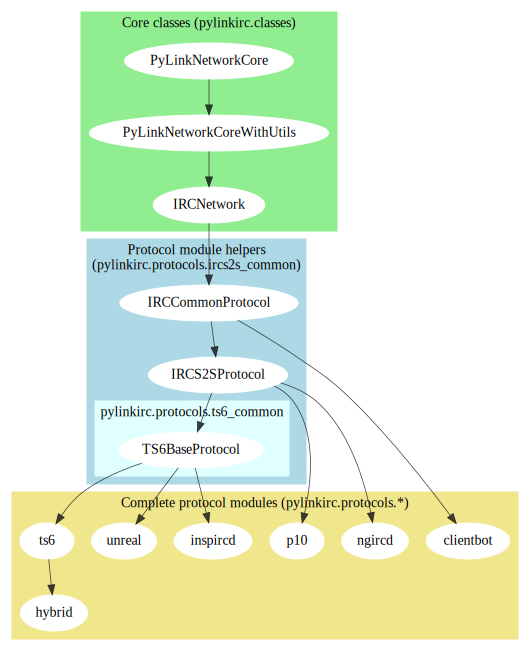

# PyLink Developer Documentation

This documentation is provided for reference only, and may not always be up to date as APIs change.
Patches are welcome if something looks wrong or *is* wrong. In such cases, consulting the source code is probably your best bet.

The docs are also really incomplete (contributions are appreciated!)

## Introduction

PyLink is an a modular, plugin-based IRC services framework. It uses swappable protocol modules and a hooks system for calling plugins, allowing them to function regardless of the IRCd used.

## Contents

- [Writing plugins for PyLink](writing-plugins.md)
- [PyLink hooks reference](hooks-reference.md)
- [Services bot API/Creating your own service bots](services-api.md)
- [Permissions API Introduction](permissions-api.md)
- [Using `utils.IRCParser()`](using-ircparser.md)

----

- [PyLink protocol module specification](pmodule-spec.md)

----

- [Release Process for PyLink](release-process.md)

