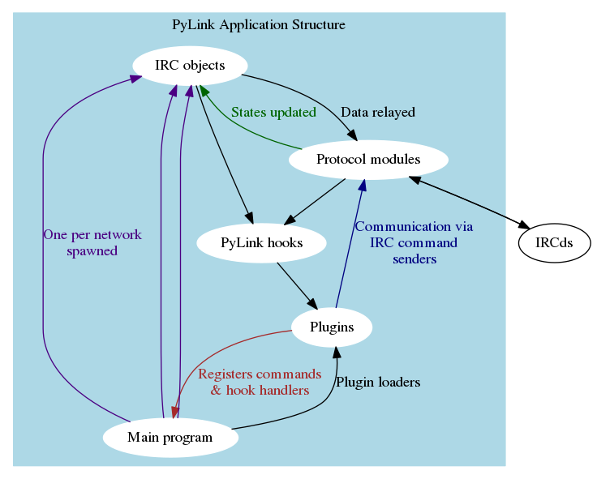

# PyLink Developer Documentation

Please note that as PyLink is still in its development phase, its APIs are subject to change.
Any documentation here is provided for reference only.

The docs are also really incomplete (contributors welcome!)

## Introduction

PyLink is an a modular, plugin-based IRC services framework. It uses swappable protocol modules and a hooks system for calling plugins, allowing them to function regardless of the IRCd used.

## Contents

- [Writing plugins for PyLink](writing-plugins.md)
- [PyLink protocol module specification](pmodule-spec.md)
- [PyLink hooks reference](hooks-reference.md)
- [Supported named channel modes](channel-modes.csv)
- [API reference: utils.py](autogen/utils.html)
- [API reference: classes.py](autogen/classes.html)

### Future topics (not yet available)
- [Writing tests for PyLink modules](writing-tests.md)
- [Supported named user modes](user-modes.csv)
- [Services bot API/Creating your own service bots](services-api.md)
