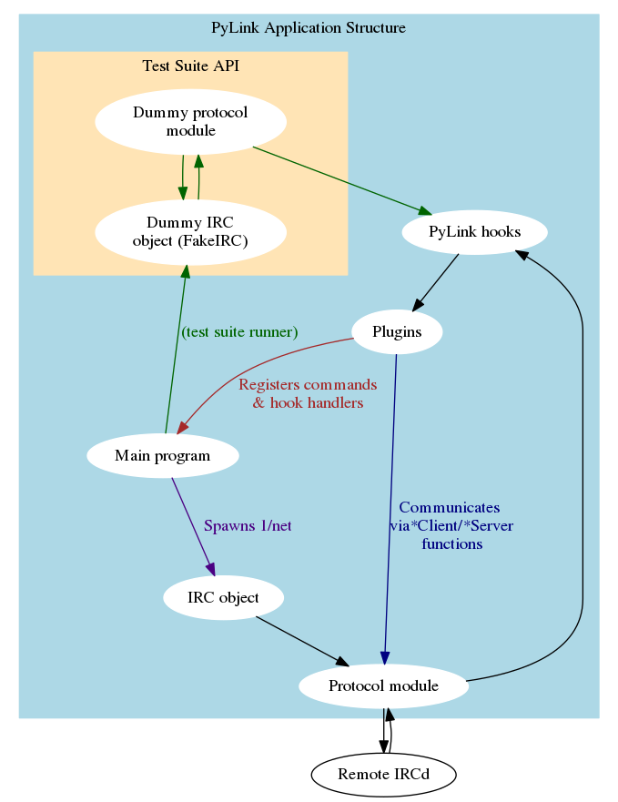

## PyLink Developer Documentation

Please note that as PyLink is still in its development phase, the API is subject to change.
Any documentation here is provided for reference only.

It is also really incomplete (contributors welcome!)

### Introduction

PyLink is an a modular, plugin-based IRC PseudoService framework. It uses swappable protocol modules and a hook-based system for calling plugins, allowing them to function regardless of the IRCd used.

### Contents

- [Writing plugins for PyLink](writing-plugins.md)
- [PyLink protocol module specification](pmodule-spec.md)

#### Future topics (not yet available)

- [Using PyLink's utils module](using-utils.md)
- [PyLink hooks reference](hooks-reference.md)
- [Writing tests for PyLink modules](writing-tests.md)
